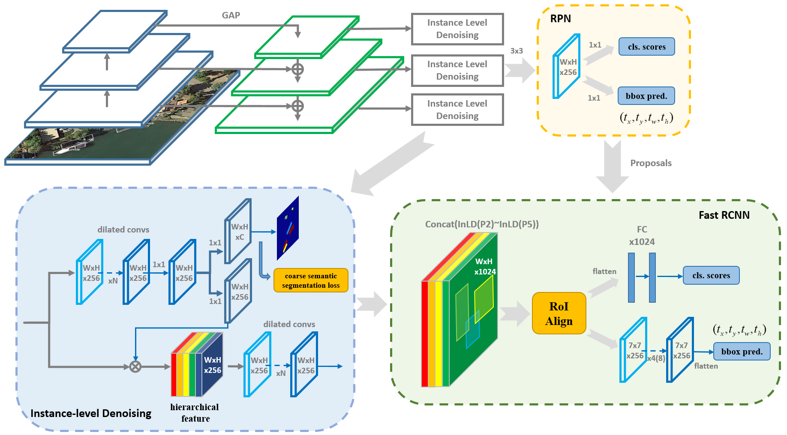
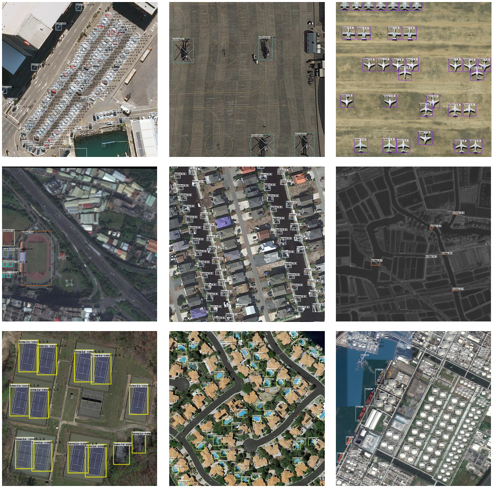
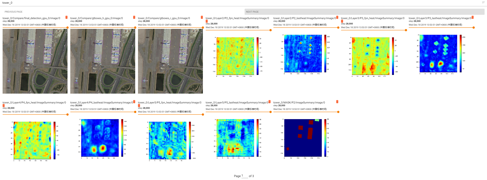
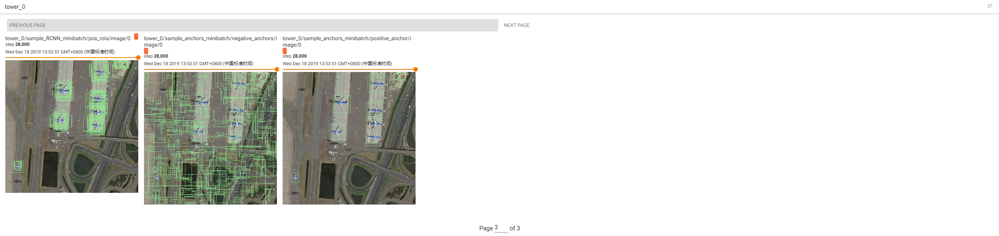

# Detecting Small, Cluttered and Rotated Objects via Instance-Level Feature Denoising

## Abstract
Instance-Level Feature Denoising (InLD) is an important part of our paper: [SCRDet++: Detecting Small, Cluttered and Rotated Objects via Instance-Level Feature Denoising and Rotation Loss Smoothing](http://thinklab.sjtu.edu.cn/SCRDet++.html).     
This repo is based on [FPN](https://arxiv.org/abs/1612.03144), and it is completed by [YangXue](https://yangxue0827.github.io/).

## Pipeline


## Performance
More results and trained models are available in the [MODEL_ZOO.md](MODEL_ZOO.md).

### DOTA1.0 (Task2)
| Model |    Backbone    |    Training data    |    Val data    |    mAP   | Model Link | Tricks | lr schd | Data Augmentation | GPU | Image/GPU | Configs |      
|:------------:|:------------:|:---------:|:-----------:|:----------:|:-----------:|:---------:|:---------:|:---------:|:---------:|:---------:|:---------:|    
| [FPN](https://arxiv.org/abs/1612.03144) (baseline) | ResNet50_v1 (600,800,1024)->800 | DOTA1.0 trainval | DOTA1.0 test | 76.03 | [model](https://drive.google.com/file/d/1aT_wvoV9ao2COZHOe6OfJglBbnFa8qqa/view?usp=sharing) | No | 1x | No | 2X Quadro RTX 8000 | 1 | cfgs_dota1.0_res50_v2.py |    
| FPN (memory consumption) | **ResNet152_v1d (600,800,1024)->MS** | DOTA1.0 trainval | DOTA1.0 test | 81.23 | [model](https://drive.google.com/file/d/1HaSU75llga_Em1O73Jp8ZwOoHPZtaVGj/view?usp=sharing) | **ALL** | **2x** | **Yes** | 2X Quadro RTX 8000 | 1 | cfgs_dota1.0_res152_v1.py |     
     

### Visualization


## My Development Environment
**docker images: docker pull yangxue2docker/yx-tf-det:tensorflow1.13.1-cuda10-gpu-py3**      
1、python3.5 (anaconda recommend)               
2、cuda >= 10.0                     
3、[opencv(cv2)](https://pypi.org/project/opencv-python/)       
4、[tfplot 0.2.0](https://github.com/wookayin/tensorflow-plot) (optional)            
5、tensorflow 1.13                            

## Download Model
### Pretrain weights
1、Please download [resnet50_v1](http://download.tensorflow.org/models/resnet_v1_50_2016_08_28.tar.gz), [resnet101_v1](http://download.tensorflow.org/models/resnet_v1_101_2016_08_28.tar.gz) pre-trained models on Imagenet, put it to data/pretrained_weights.       
2、**(Recommend in this repo)** Or you can choose to use a better backbone, refer to [gluon2TF](https://github.com/yangJirui/gluon2TF).    
* [Baidu Drive](https://pan.baidu.com/s/1GpqKg0dOaaWmwshvv1qWGg), password: 5ht9.          
* [Google Drive](https://drive.google.com/drive/folders/1BM8ffn1WnsRRb5RcuAcyJAHX8NS2M1Gz?usp=sharing)      

## Compile
```  
cd $PATH_ROOT/libs/box_utils/cython_utils
python setup.py build_ext --inplace (or make)
```

## Train

1、If you want to train your own data, please note:  
```     
(1) Modify parameters (such as CLASS_NUM, DATASET_NAME, VERSION, etc.) in $PATH_ROOT/libs/configs/cfgs.py
(2) Add category information in $PATH_ROOT/libs/label_name_dict/lable_dict.py     
(3) Add data_name to $PATH_ROOT/data/io/read_tfrecord_multi_gpu.py 
```     

2、Make tfrecord     
For DOTA dataset:      
```  
cd $PATH_ROOT\data\io\DOTA
python data_crop.py
```  

```  
cd $PATH_ROOT/data/io/  
python convert_data_to_tfrecord.py --VOC_dir='/PATH/TO/DOTA/' 
                                   --xml_dir='labeltxt'
                                   --image_dir='images'
                                   --save_name='train' 
                                   --img_format='.png' 
                                   --dataset='DOTA'
```      

3、Multi-gpu train
```  
cd $PATH_ROOT/tools
python multi_gpu_train.py
```

## Test
```  
cd $PATH_ROOT/tools
python test_dota_ms.py --test_dir='/PATH/TO/IMAGES/'  
                       --gpus=0,1,2,3,4,5,6,7   
                       -s (visualization, optional)
                       -ms (multi-scale test, optional)
``` 

**Notice: In order to set the breakpoint conveniently, the read and write mode of the file is' a+'. If the model of the same #VERSION needs to be tested again, the original test results need to be deleted.**      


## Tensorboard
```  
cd $PATH_ROOT/output/summary
tensorboard --logdir=.
``` 

 
    

     



## Citation

If this is useful for your research, please consider cite.

```
@article{yang2020scrdet++,
    title={SCRDet++: Detecting Small, Cluttered and Rotated Objects via Instance-Level Feature Denoising and Rotation Loss Smoothing},
    author={Yang, Xue and Yan, Junchi and Yang, Xiaokang and Tang, Jin and Liao, Wenglong and He, Tao},
    journal={arXiv preprint arXiv:2004.13316},
    year={2020}
}
```

## Reference
1、https://github.com/endernewton/tf-faster-rcnn   
2、https://github.com/zengarden/light_head_rcnn   
3、https://github.com/tensorflow/models/tree/master/research/object_detection    
4、https://github.com/fizyr/keras-retinanet     
