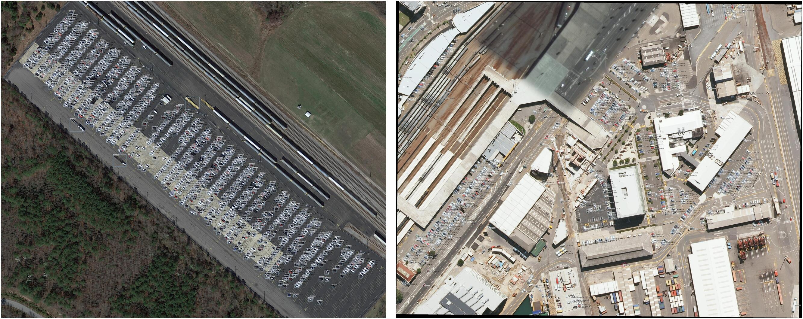

# DOTA-DOAI

## Abstract
This repo is the codebase for our team to participate in DOTA related competitions, including rotation and horizontal detection. We mainly use [FPN](https://arxiv.org/abs/1612.03144)-based two-stage detector, and it is completed by [YangXue](https://yangxue0827.github.io/) and [YangJirui](https://github.com/yangJirui).    

## Performance
### DOTA1.0 (Task1)
| Model |    Backbone    |    Training data    |    Val data    |    mAP   | Model Link | Tricks | lr schd | Data Augmentation | GPU | Image/GPU | Configs |      
|:------------:|:------------:|:---------:|:-----------:|:----------:|:-----------:|:---------:|:---------:|:---------:|:---------:|:---------:|:---------:|    
| FPN | **ResNet152_v1d (600,800,1024)->MS** | DOTA1.0 trainval | DOTA1.0 test | 78.99 | [model](https://drive.google.com/file/d/16lZEttBN3asEDP7lIryvH-PByjxm6A7K/view?usp=sharing) | **ALL** | **2x** | **Yes** | 2X GeForce RTX 2080 Ti | 1 | cfgs_dota1.0_res152_v1.py | 
### DOTA1.0 (Task2)
| Model |    Backbone    |    Training data    |    Val data    |    mAP   | Model Link | Tricks | lr schd | Data Augmentation | GPU | Image/GPU | Configs |      
|:------------:|:------------:|:---------:|:-----------:|:----------:|:-----------:|:---------:|:---------:|:---------:|:---------:|:---------:|:---------:|    
| FPN (memory consumption) | **ResNet152_v1d (600,800,1024)->MS** | DOTA1.0 trainval | DOTA1.0 test | 81.23 | [model](https://drive.google.com/file/d/1HaSU75llga_Em1O73Jp8ZwOoHPZtaVGj/view?usp=sharing) | **ALL** | **2x** | **Yes** | 2X Quadro RTX 8000 | 1 | cfgs_dota1.0_res152_v1.py |     

### Visualization

## Performance of published papers on DOTA datasets
### DOTA1.0 (Task1)
| Model | Backbone | mAP | Paper Link | Code Link | Remark | Recommend |
|:-----:|:--------:|:---:|:----------:|:---------:|:---------:|:---------:|
| FR-O (DOTA) | ResNet101 | 52.93 | [CVPR2018](http://openaccess.thecvf.com/content_cvpr_2018/html/Xia_DOTA_A_Large-Scale_CVPR_2018_paper.html) | [MXNet](https://github.com/jessemelpolio/Faster_RCNN_for_DOTA) | DOTA dataset, baseline | :white_check_mark: |
| IENet | ResNet101 | 57.14 | [arXiv:1912.00969](https://arxiv.org/abs/1912.00969) | - | anchor free | |
| TOSO | ResNet101 | 57.52 | [ICASSP2020](https://ieeexplore.ieee.org/document/9053562) | - | geometric transformation | |
| PIoU Loss | DLA-34 | 60.5 | [ECCV2020](https://arxiv.org/abs/2007.09584) | [Pytorch](https://github.com/clobotics/piou) | IoU loss, anchor free | :white_check_mark: |
| R2CNN | ResNet101 | 60.67 | [arXiv:1706.09579](https://arxiv.org/abs/1706.09579) | [TF](https://github.com/DetectionTeamUCAS/R2CNN_Faster-RCNN_Tensorflow) | scene text, multi-task, different pooled sizes, baseline | :white_check_mark: |
| RRPN | ResNet101 | 61.01 | [TMM](https://ieeexplore.ieee.org/document/8323240)   [arXiv:1703.01086](https://arxiv.org/pdf/1703.01086.pdf) | [TF](https://github.com/DetectionTeamUCAS/RRPN_Faster-RCNN_Tensorflow) | scene text, rotation proposals, baseline | :white_check_mark: |
| RetinaNet-H | ResNet101 | 64.73 | [arXiv:1908.05612](https://arxiv.org/abs/1908.05612) | [TF](https://github.com/DetectionTeamUCAS/RetinaNet_Tensorflow_Rotation) | single stage, baseline | :white_check_mark: |
| Axis Learning | ResNet101 | 65.98 | [Remote Sensing](https://www.mdpi.com/2072-4292/12/6/908) | - | single stage, anchor free | :white_check_mark: |
| ICN | ResNet101 | 68.16 | [ACCV2018](https://link.springer.com/chapter/10.1007/978-3-030-20893-6_10) | - | image cascade, multi-scale | :white_check_mark: |
| RADet | ResNeXt101 | 69.09 | [Remote Sensing](https://www.mdpi.com/2072-4292/12/3/389) | - | enhanced FPN, mask rcnn | |
| RoI Transformer | ResNet101 | 69.56 | [CVPR2019](http://openaccess.thecvf.com/content_CVPR_2019/papers/Ding_Learning_RoI_Transformer_for_Oriented_Object_Detection_in_Aerial_Images_CVPR_2019_paper.pdf) | [MXNet](https://github.com/dingjiansw101/RoITransformer_DOTA), [Pytorch](https://github.com/dingjiansw101/AerialDetection) | roi transformer | :white_check_mark: |
| P-RSDet | ResNet101 | 69.82 | [arXiv:2001.02988](https://arxiv.org/abs/2001.02988) | - | anchor free, polar coordinates | :white_check_mark: |
| CAD-Net | ResNet101 | 69.90 | [TGRS](https://ieeexplore.ieee.org/document/8804364/)  [arXiv:1903.00857](https://arxiv.org/abs/1903.00857) | - | attention |  |
| AOOD | ResNet101 | 71.18 | [Neural Computing and Applications](https://link.springer.com/article/10.1007/s00521-020-04893-9) | - | attention + [R-DFPN](https://www.mdpi.com/2072-4292/10/1/132) |  |
| Cascade-FF | ResNet152 | 71.80 | [ICME2020](https://ieeexplore.ieee.org/abstract/document/9102807) | - | Refined RetinaNet + feature fusion |  |
| BBAVectors | ResNet101 | 72.32| [WACV2021](https://arxiv.org/abs/2008.07043) | [Pytorch](https://github.com/yijingru/BBAVectors-Oriented-Object-Detection) |  keypoint based  | :white_check_mark: |
| ROPDet | ResNet101-DCN | 72.42 | [J REAL-TIME IMAGE PR](https://link.springer.com/article/10.1007/s11554-020-01013-7) | - | point set representation |  |
| SCRDet | ResNet101 | 72.61 | [ICCV2019](http://openaccess.thecvf.com/content_ICCV_2019/papers/Yang_SCRDet_Towards_More_Robust_Detection_for_Small_Cluttered_and_Rotated_ICCV_2019_paper.pdf) | [TF:R2CNN++](https://github.com/DetectionTeamUCAS/R2CNN-Plus-Plus_Tensorflow), IoU-Smooth L1: [RetinaNet-based](https://github.com/SJTU-Thinklab-Det/R3Det_Tensorflow), [R3Det-based](https://github.com/DetectionTeamUCAS/RetinaNet_Tensorflow_Rotation) | attention, angular boundary problem | :white_check_mark: |
| O2-DNet | Hourglass104 | 72.8 | [ISPRS](https://www.sciencedirect.com/science/article/pii/S0924271620302690), [arXiv:1912.10694](https://arxiv.org/abs/1912.10694) | - | centernet, anchor free | :white_check_mark: |
| SARD | ResNet101 | 72.95 | [Access](https://ieeexplore.ieee.org/stamp/stamp.jsp?tp=&arnumber=8917630) | - | IoU-based weighted loss | |
| GLS-Net | ResNet101 | 72.96 | [Remote Sensing](https://www.mdpi.com/2072-4292/12/9/1435) | - | attention, saliency pyramid |  |
| DRN | Hourglass104 | 73.23 | [CVPR(oral)](https://arxiv.org/abs/2005.09973) | [code](https://github.com/Anymake/DRN_CVPR2020) | centernet, feature selection module, dynamic refinement head, new dataset (SKU110K-R) | :white_check_mark: |
| FADet | ResNet101 | 73.28 | [ICIP2019](https://ieeexplore.ieee.org/abstract/document/8803521) | - | attention | |
| MFIAR-Net | ResNet152 | 73.49 | [Sensors](https://www.mdpi.com/1424-8220/20/6/1686/htm) | - | feature attention, enhanced FPN | |
| R3Det | ResNet152 | 73.74 | [arXiv:1908.05612](https://arxiv.org/abs/1908.05612) | [TF](https://github.com/SJTU-Thinklab-Det/R3Det_Tensorflow), [Pytorch](https://github.com/SJTU-Thinklab-Det/r3det-on-mmdetection) | refined single stage, feature alignment | :white_check_mark: |
| RSDet | ResNet152 | 74.10 | [arXiv:1911.08299](https://arxiv.org/abs/1911.08299) | - | quadrilateral bbox, angular boundary problem | :white_check_mark: |
| Gliding Vertex | ResNet101 | 75.02 | [TPAMI](https://ieeexplore.ieee.org/document/9001201)  [arXiv:1911.09358](https://arxiv.org/abs/1911.09358) | [Pytorch](https://github.com/MingtaoFu/gliding_vertex) | quadrilateral bbox | :white_check_mark: |
| EFN | U-Net | 75.27 | [Preprints](https://search.proquest.com/docview/2442440949?pq-origsite=gscholar&fromopenview=true) | - | Field-based | :white_check_mark: |
| Mask OBB | ResNeXt-101 | 75.33 | [Remote Sensing](https://www.mdpi.com/2072-4292/11/24/2930/htm) | - | attention, multi-task | :white_check_mark: |
| FFA | ResNet101 | 75.7 | [ISPRS](https://www.sciencedirect.com/science/article/abs/pii/S0924271620300319) | - | enhanced FPN, rotation proposals | |
| APE | ResNeXt-101(32x4) | 75.75 | [TGRS](https://ieeexplore.ieee.org/abstract/document/9057525) [arXiv:1906.09447](https://arxiv.org/abs/1906.09447) | - | adaptive period embedding, length independent IoU (LIIoU)| :white_check_mark: |     
| R4Det | ResNet152 | 75.54 | [Image Vis Comput](https://www.sciencedirect.com/science/article/pii/S0262885620301682) | - | feature recursion and refinement |  |     
| CenterMap OBB | ResNet101 | 76.03| [TGRS](https://ieeexplore.ieee.org/abstract/document/9151222) | - | center-probability-map |  |
| CSL | ResNet152 | 76.17 | [ECCV2020](http://arxiv.org/abs/2003.05597) | [TF:CSL_RetinaNet](https://github.com/Thinklab-SJTU/CSL_RetinaNet_Tensorflow) | angular boundary problem | :white_check_mark: |
| OWSR | Ensemble (ResNet101 +  ResNeXt101 + mdcn-ResNet101) | 76.36 | [CVPR2019 WorkShop](http://openaccess.thecvf.com/content_CVPRW_2019/papers/DOAI/Li_Learning_Object-Wise_Semantic_Representation_for_Detection_in_Remote_Sensing_Imagery_CVPRW_2019_paper.pdf)   [TGRS](https://ieeexplore.ieee.org/abstract/document/8960460) | - | enhanced FPN | |
| R3Det++ | ResNet152 | 76.56 | [arXiv:2004.13316](https://arxiv.org/abs/2004.13316) | [TF](https://github.com/SJTU-Thinklab-Det/R3Det_Tensorflow) | refined single stage, feature alignment, denoising | :white_check_mark: |
| SCRDet++ | ResNet101 | 76.81 | [arXiv:2004.13316](https://arxiv.org/abs/2004.13316) | [TF](https://github.com/SJTU-Thinklab-Det/DOTA-DOAI) | angular boundary problem, denoising | :white_check_mark: |
| FR-Est | ResNet101-DCN | 78.49| [TGRS](https://ieeexplore.ieee.org/abstract/document/9194345) | - | point-based estimator | :white_check_mark: |
| S2A-Net | ResNet101 | 79.15 | [arXiv:2008.09397](https://arxiv.org/abs/2008.09397) | [Pytorch](https://github.com/csuhan/s2anet) | refined single stage, feature alignment | :white_check_mark: |

### DOTA1.0 (Task2)
| Model | Backbone | mAP | Paper Link | Code Link | Remark | Recommend |
|:-----:|:--------:|:---:|:----------:|:---------:|:---------:|:---------:|
| FR-H (DOTA) | ResNet101 | 60.46 | [CVPR2018](http://openaccess.thecvf.com/content_cvpr_2018/html/Xia_DOTA_A_Large-Scale_CVPR_2018_paper.html) | [MXNet](https://github.com/jessemelpolio/Faster_RCNN_for_DOTA) | DOTA dataset, baseline | :white_check_mark: |
| Deep Active Learning | ResNet18 | 64.26 | [arXiv:2003.08793](https://arxiv.org/abs/2003.08793) | - | CenterNet, Deep Active Learning | :white_check_mark: |
| SBL | ResNet50 | 64.77 | [arXiv:1810.08103](https://arxiv.org/abs/1810.08103) | - | single stage |
| FMSSD | VGG16 | 72.43 | [TGRS](https://ieeexplore.ieee.org/abstract/document/8930933) | - | IoU-based weighted loss, enhanced FPN |  |
| ICN | ResNet101 | 72.45 | [ACCV2018](https://link.springer.com/chapter/10.1007/978-3-030-20893-6_10) | - | image cascade, multi-scale | :white_check_mark: |
| IoU-Adaptive R-CNN | ResNet101 | 72.72 | [Remote Sensing](https://www.mdpi.com/2072-4292/11/3/286) | - | IoU-based weighted loss, cascade| |
| EFR | VGG16 | 73.49 | [Remote Sensing](https://www.mdpi.com/2072-4292/11/18/2095) | [Pytorch](https://github.com/pioneer2018/dtdm-di) | enhanced FPN | |
| SCRDet | ResNet101 | 75.35 | [ICCV2019](http://openaccess.thecvf.com/content_ICCV_2019/papers/Yang_SCRDet_Towards_More_Robust_Detection_for_Small_Cluttered_and_Rotated_ICCV_2019_paper.pdf) | [TF](https://github.com/DetectionTeamUCAS/R2CNN-Plus-Plus_Tensorflow) | attention, angular boundary problem | :white_check_mark: |
| FADet | ResNet101 | 75.38 | [ICIP2019](https://ieeexplore.ieee.org/abstract/document/8803521) | - | attention | |
| MFIAR-Net | ResNet152 | 76.07 | [Sensors](https://www.mdpi.com/1424-8220/20/6/1686/htm) | - | feature attention, enhanced FPN | |
| Mask OBB | ResNeXt-101 | 76.98 | [Remote Sensing](https://www.mdpi.com/2072-4292/11/24/2930/htm) | - | attention, multi-task | :white_check_mark: |
| CenterMap OBB | ResNet101 | 77.33| [TGRS](https://ieeexplore.ieee.org/abstract/document/9151222) | - | center-probability-map |  |
| A2RMNet | ResNet101 | 78.45 | [Remote Sensing](https://www.mdpi.com/2072-4292/11/13/1594) | - | attention, enhanced FPN, different pooled sizes | |
| OWSR | Ensemble (ResNet101 +  ResNeXt101 + mdcn-ResNet101) | 78.79 | [CVPR2019 WorkShop](http://openaccess.thecvf.com/content_CVPRW_2019/papers/DOAI/Li_Learning_Object-Wise_Semantic_Representation_for_Detection_in_Remote_Sensing_Imagery_CVPRW_2019_paper.pdf)   [TGRS](https://ieeexplore.ieee.org/abstract/document/8960460) | - | enhanced FPN | |
| Parallel Cascade R-CNN |ResNeXt-101 | 78.96 | [Journal of Physics: Conference Series](https://iopscience.iop.org/article/10.1088/1742-6596/1544/1/012124/meta) | - | cascade rcnn | |
| DM-FPN | ResNet-Based | 79.27 | [Remote Sensing](https://www.mdpi.com/2072-4292/11/7/755/) | - | enhanced FPN | |
| SCRDet++ | ResNet101 | 79.35 | [arXiv:2004.13316](https://arxiv.org/abs/2004.13316) | [TF](https://github.com/SJTU-Thinklab-Det/DOTA-DOAI) | denoising | :white_check_mark: |

### DOTA1.5 (Task1)
| Model | Backbone | mAP | Paper Link | Code Link | Remark | Recommend |
|:-----:|:--------:|:---:|:----------:|:---------:|:---------:|:---------:|
| APE | ResNeXt-101(32x4) | 78.34 | [TGRS](https://ieeexplore.ieee.org/abstract/document/9057525) [arXiv:1906.09447](https://arxiv.org/abs/1906.09447) | - | length independent IoU (LIIoU)| :white_check_mark: |
| OWSR | Ensemble (ResNet101 +  ResNeXt101 + mdcn-ResNet101) | 76.60 | [TGRS](https://ieeexplore.ieee.org/abstract/document/8960460) [CVPR2019 WorkShop](http://openaccess.thecvf.com/content_CVPRW_2019/papers/DOAI/Li_Learning_Object-Wise_Semantic_Representation_for_Detection_in_Remote_Sensing_Imagery_CVPRW_2019_paper.pdf) | - | enhanced FPN | |

### DOTA1.5 (Task2)
| Model | Backbone | mAP | Paper Link | Code Link | Remark | Recommend | 
|:-----:|:--------:|:---:|:----------:|:---------:|:---------:|:---------:|
| OWSR | Ensemble (ResNet101 +  ResNeXt101 + mdcn-ResNet101) | 79.50 | [TGRS](https://ieeexplore.ieee.org/abstract/document/8960460) [CVPR2019 WorkShop](http://openaccess.thecvf.com/content_CVPRW_2019/papers/DOAI/Li_Learning_Object-Wise_Semantic_Representation_for_Detection_in_Remote_Sensing_Imagery_CVPRW_2019_paper.pdf) | - | enhanced FPN | |

### Related Articles
| Model | Paper Link | Code Link | Remark | Recommend | 
|:-----:|:----------:|:---------:|:------:| :------: | 
| SSSDET | [ICIP2019](https://ieeexplore.ieee.org/abstract/document/8803262)  [arXiv:1909.00292](https://arxiv.org/abs/1909.00292) | - | vehicle detection, lightweight | |
| AVDNet | [GRSL](https://ieeexplore.ieee.org/abstract/document/8755462)  [arXiv:1907.07477](https://arxiv.org/abs/1907.07477) | - | vehicle detection, small object | |
| ClusDet | [ICCV2019](http://openaccess.thecvf.com/content_ICCV_2019/papers/Yang_Clustered_Object_Detection_in_Aerial_Images_ICCV_2019_paper.pdf) | [Caffe2](https://github.com/fyangneil/Clustered-Object-Detection-in-Aerial-Image) | object cluster regions | :white_check_mark: |
| DMNet | [CVPR2020 WorkShop](https://arxiv.org/abs/2004.05520) | - | object cluster regions | :white_check_mark: |
| OIS | [arXiv:1911.07732](https://arxiv.org/abs/1911.07732) | [related Pytorch code](https://github.com/mrlooi/rotated_maskrcnn) | Oriented Instance Segmentation | :white_check_mark: |
| LR-RCNN | [arXiv:2005.14264 ](https://arxiv.org/abs/2005.14264) | - | vehicle detection | - |
| GRS-Det | [TGRS](https://ieeexplore.ieee.org/abstract/document/9186810) | - | ship detection, rotation fcos | - |
| DRBox-v2 | [TGRS](https://ieeexplore.ieee.org/document/8746781) | [TF](https://github.com/ZongxuPan/DrBox-v2-tensorflow) | sar ship detection, rotation fcos | - |

## Dataset
Some remote sensing related object detection dataset statistics are in [DATASET.md](DATASET.md)
